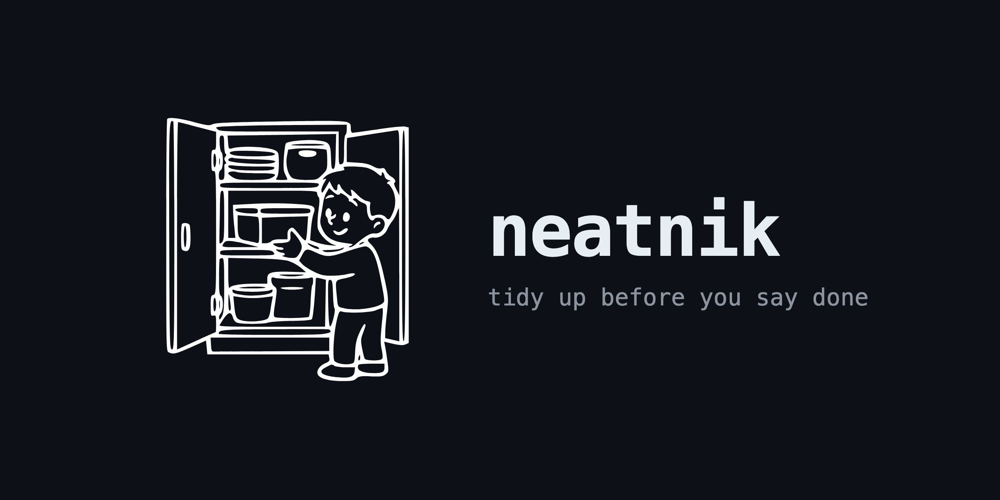

<p align="center"></p>

# Neatnik

**Most agent tooling decides what to build. Neatnik decides who judges it, and what happens when it's wrong.**

Your agent finishes a task and tells you it's done. You believe it, because checking would cost you
the afternoon. That's the whole problem, and no amount of prompt engineering fixes it: it's an
architecture problem.

Neatnik is a skill that walks into a project and installs the machine around the model: a separate
judge, a contract negotiated before anything is built, a gate that decides what ships, and a written
record of what was decided and why. It doesn't plan your work. It designs the thing that keeps your
work honest after you stop looking.

```
neatnik <goal>            new project, before any code exists
neatnik audit <project>   something already running. Delivers a verdict, and never rewrites
neatnik tidy <project>    before you say "ready": is every decision you took actually in there?
```

The third mode came last and it is the one I now reach for most. More on it below.

---

## Why this exists

I built it because I kept catching the same failure in my own agents, and it was never the failure I
expected. Not hallucinated code. Something quieter:

- an agent reported a platform limit that didn't exist. It had just called the API wrong, and the
  error message sounded like a verdict about the world
- a script counted the wrong denominator and reported **100% coverage** where the real number was
  **54%**
- a regex matched one of three call styles and concluded a dependency graph had 16 nodes; it had 21
- a measurement declared a value "not computable" while the value sat in a file the script had
  written itself

Four instances of one mechanism: **a tool looks at too little, and whoever runs it promotes its
narrow field of view into a property of the world.** It doesn't look like a bug. It looks like an
honest report.

Every one of them was caught by a round whose only mandate was to attack. None was caught by the
agent that produced it.

## What's actually in here

Nine rules that came out of that, each with the failure it answers. These are the ones I'd keep if I
could keep only nine.

**1. The judge never sees the reasoning.** It gets the artifact and the rubric, nothing else. If the
same context does the work and grades it, you get confabulation. A judge that reads the
justification isn't a judge.

**2. The judge opens the product and uses it.** It doesn't read the diff. The case that names this
rule: an app where every write had landed (canvas, palette, timeline, editor) and pressing an
arrow key did nothing. The agent had no idea how to test itself.

**3. A declared limit carries its proof.** *"It can't be done"* is the only conclusion nobody ever
checks, because disproving it means doing the work you just called impossible. It's the one claim
that protects itself. So before you write it, you write three lines: the exact error text; the
counterexample you looked for in work you already did; and what would have to be true for the limit
to be real. Say **"I didn't find a way,"** never *"it can't be done."*

**4. The loop exits on verification, not on a counter.** No "max 2 retries." You exit when the
independent verifier has verified. What holds the loop up is that **"not verifiable" is a
legitimate outcome**, provided it ships with the list of what wasn't looked at.

**5. A round that confirms doesn't count as a round.** At least one pass has a mandate to *demolish*.
Measured across six rounds: the confirming rounds found nothing the producer hadn't already seen; the
attacking rounds found something every single time, including in work I'd just signed off on.

**6. Sources are law, and you date them by the models they name.** When two authoritative sources
contradict each other, the more recent one wins. And you don't get the date from the file: you get
it from which models the speaker mentions. One talk places itself two model versions back; the other
lists two model families the first has never heard of. That's your ordering.

**7. An agent's mandate is counted in outputs.** *"N rows, in this file, in this format"*, never
*"at least N."* Measured on the same day, same model, same tools: five agents with a countable
mandate returned **1,387 verdicts in ~15 minutes**. Two agents told *"at least 20"* returned **0
bytes in 57 minutes**. "At least" is open-ended upward, so there's no point at which the agent can
say *I'm done*.

**8. Delivery is a file.** Not a message. A message can fail to arrive without either side knowing:
four agents once finished their work and announced themselves idle while the relay was dead in both
directions. A missing file is visible. A missing message isn't.

**9. Translation is a step, not a courtesy.** Whoever brings a decision to the owner brings it
translated: jargon dissolved, options on separate lines, numbers with their meaning attached, and a
recommendation carrying its reason. You simplify the language, never the data. The test that it's
working: the owner sometimes answers **against** the recommendation, with a good reason. A
translation that only collects "yes" is steering.

## `tidy`: the check you run before you say "ready"

This one exists because of a specific bad afternoon. I had spent four days building something, I said
it was finished, and roughly a fifth of what we had decided was actually in it. The owner found that
out, not me. The defence hadn't failed through carelessness. There was no check that *could* fail on a
decision that stayed on paper.

So `tidy` answers one question: **is everything we saw, decided and reviewed actually in there?**

It starts from the decision and looks for it in the artifact, never the reverse. Reading the artifact
and asking "which decision is this?" only ever finds what you already have. Every decision lands in
one of four boxes:

| box | meaning |
|---|---|
| `IMPLEMENTED` | it's there, and the line says who does what, and when |
| `PARTIAL` | the name is there, or half the rule, but not the step that puts it to work |
| `ABSENT` | not in any file, and only after a search that *could* have found it |
| `OUT OF SCOPE` | it never belonged in the artifact. Written down, not counted as a hole |

The middle box is the whole point. Without it everything becomes *"it's there"*, and that is where the
dominant defect lives.

### Three levels, and what actually changes

**Coverage is never cut.** All three levels read every decision on the first pass. What changes is how
hard the claims get attacked and how many times you go round. A level that looks at less isn't
cheaper, it's more dishonest: *"I didn't look at it"* and *"I looked and it was fine"* resemble each
other far too much.

| | attack | stops when |
|---|---|---|
| `:low` | reopens filled boxes **until 5 in a row hold**, floor 8, ceiling 20 | one pass. It may **not** use the word *complete* |
| `:medium` | reopens **every** filled box | no pass finds anything under 100% |
| `:max` | every filled box **plus the holes**: does the thing declared missing exist somewhere? | two passes in a row with nothing blocking and the attack under 10% |

Two design choices in there are worth explaining, because both replaced something that didn't work.

**The sample stops on a condition, not on a count.** A fixed number decides when to stop without
looking at what it is finding: it halts at eight one step before the big one, or it digs to twenty
inventing work to justify itself. Here the condition for stopping is **finding it clean**, never
*having found enough*, so digging doesn't pay. The ceiling isn't a limit on the search: when it's hit
without ever seeing five clean in a row, the round declares *"this count is too inflated for a low
level"* and escalates itself.

**The original stop rule was "until a round comes back completely empty", and it was unreachable by
construction.** The attacker always finds *something* non-blocking, because that is its job. Measured:
twelve passes without ever stopping, and what finally stopped the round was the pass ceiling, not
cleanliness. A threshold nobody can reach isn't rigour. It's a loop that never ends, and always ends
badly.

### The part that cost the most to learn

The first working version re-read **all 441 decisions on every pass**. By pass twelve I was paying to
re-confirm 433 items that pass one had already settled: **13.8 million tokens over five and a half
hours**, most of it spent agreeing with itself.

Coverage must not be *cut*. It also must not be *repeated*. Those are different sentences, and I had
been reading them as one. Now the first pass reads everything and later passes read **the delta**,
which is two things added together:

- **what fell** in the last attack, or stayed open
- **what got touched** after that pass had already read it, which the pass finds for itself with a
  `find -newermt` rather than trusting a list

Drop the second half and every fix made after the last read gets counted as *already verified*, which
is the exact defect the round exists to catch, performed by the round itself.

Measured on the next run: a delta pass read **0.16 MB against 2.19 MB** for the four full readers.
About 93% less, on the part that dominated the bill.

And one rule that came out of watching a round burn: **you don't touch the artifact while a round is
reading it.** Correcting mid-flight shifted the `file:line` references under the feet of the agent
verifying them, and the attacker produced whole blocks of off-by-one findings: true as observations,
useless as work, and indistinguishable from real defects for whoever reads the delivery.

## Designing the agent, not just checking its output

`tidy` gets the most attention here because it's the mode I reach for daily, but it isn't what Neatnik
*is*. Read `neatnik <goal>` again: it doesn't hand you a checklist, it installs a judge and negotiates
a contract before a line of code exists. The point of the whole method is the **loop** that step 3 of
`SKILL.md` runs over every technical choice a project makes, and it has four parameters, not one:

| Parameter | Rejects |
|---|---|
| **cheap** | what it costs every time it runs |
| **simple** | how many pieces have to be true at once |
| **effective** | does it reach the goal, and does it create value beyond bare compliance |
| **sound** | does the agentic shape itself follow the field's own build guidance — always |

*Sound* is the one that keeps the loop from collapsing into the other three, because without it the
winner is always **one agent that does everything and declares itself fine**. It's judged by a
**second, separate judge** — the artifact judge never sees a technical choice, and the technical judge
never sees an artifact's rubrics: each would invent what it doesn't hold. That split is deliberate:
Neatnik treats "is this a sound piece of agent architecture" as a first-class, checkable question, not
a feeling somebody has after shipping.

The rubric that makes *sound* falsifiable — eight groups, `A` through `H`, one id per line, each
pointing at a source line — is built the same way every other rubric in this repo is built, and for
the same declared reasons: no weights, only what it rejects, a pointer to the line it came from. It
isn't shipped in this repository because its rows quote engineering talks line by line, and those
transcripts aren't mine to republish. **The method for building it is here; the rows come from your own
sources.** See `skills/neatnik/RUBRICS.md`, "The sound rubric, and why it isn't shipped here", for the
exact recipe.

This is the part of Neatnik that's easiest to miss if you only ever run `tidy`: the same discipline
that checks whether a decision got implemented is what checks whether the *agent itself* was worth
building the way it was built — one judge per axis, a contract negotiated before construction, and a
shell and a trigger designed as deliberately as the prompt.

## What ships as executable

The method used to prescribe checks and ship none, which is a rule with nobody to run it. Six tools
now come with it, each with a self-test, and every one of them exits **2** when it could not look at
anything, rather than 0. That distinction matters more than it sounds: *"I couldn't look"* must never
be able to resemble *"I looked and it was fine"*.

| | |
|---|---|
| `tools/tidy.js` | the round itself: reads, attacks, remediates, re-runs, escalates on its own |
| `tools/citations.py` | rung one, made executable: does every `file:line` you cited actually exist? |
| `tools/images.py` | the check behind rubric 1: measures images instead of looking at them |
| `tools/inventory.py` | rebuilds the count from what the agents wrote, not from what they claimed |
| `tools/coverage.py` | exits 1 if a decision isn't at 100%, and 2 if the inventory is too small to mean anything |
| `tools/history.py` | one line per round, and the curve |

The curve is worth its own line. Across a dozen rounds the single most useful artifact wasn't any one
round: it was the **sequence**, which is what tells you whether you are converging or just writing.
And reading it is counter-intuitive. **The defect rate can climb while the object improves**: once the
big holes are closed, the attacker stops looking for *missing* and starts looking for *declared with
nobody to execute it*, which is harder to find and easier to get wrong. A rate climbing on an
improving object is an attacker raising its aim. What has to fall is the **severity**: whole decisions
collapsing first, then only downgrades.

## How it was built

Not designed and then justified. Built by measuring, being wrong repeatedly, and having someone else
prove it. The pipeline had four stages, and each one existed because the stage before it turned out to
be unreliable.

**1. Read the sources line by line.** Seven engineering talks on agent systems, plus measurements on a
real production system: dozens of automations and scheduled jobs, several running unattended. Reading
them line by line rather than summarising them is the whole difference: a summary keeps the ideas you
already agreed with.

**2. Extract every prescription, and mark who said it.** 260 prescriptive teachings came out. Each one
carries a mark saying whether a source prescribed it or we added it. That mark isn't decoration: the
law here is that source prescriptions don't get pruned and our own additions do, so an addition that
looks like a prescription is **unprunable**, and it lives forever by accident.

**3. Grade the method against them, from the source toward the method.** One agent per source, never
the reverse direction. Reading the method and asking *"which teaching is this?"* only finds what you
already know you have, and one of the sources has a name for that failure: a **saturated eval**.

**4. Attack every grade.** A second agent, mandated to demolish. This is where the method earned its
trust, and it is also where it looked worst.

The provenance rule that holds the whole thing up, and the reason the result is worth anything:

> **Every number comes from a rerunnable command, never from a previous document.**

That rule caught its own violations. Ten times across five days, a claim in this project turned out
to be a **half-quotation**: a real sentence, cut short or glossed, producing a plausible and false
conclusion. Four of those were mine. The pattern is worth naming because it's the tax on this kind of
work: the citation is usually correct, and the sentence *next to it* is where the error lives.

**The attack found 76% of the reopened claims defective** — the highest rate measured anywhere in the
project. And the defect had a direction worth knowing about, because it repeated in every round since:
of 42 *"covered"* labels reopened, **33 didn't hold**, nearly all of them pointing at a line that named
the concept without saying who does it or when. But the other column was inflated too, in the opposite
direction: **9 of 22 *"absent"* labels weren't absent** — the thing existed and the checker hadn't
found it. Both extremes lie, in opposite directions, which is why `:max` attacks the holes as well.

That is also where the longest-surviving defect got its name, and it's worth searching your own work
for: **the rule is written and no step executes it.** It survives every round precisely *because*
`grep` finds it. The line is there, it says the right thing, and it has no subject. The signs: a file
no step ever opens; a line that says what must be true without saying who makes it true; a pointer
aimed at a section that doesn't describe what it promises. The cure isn't adding lines. It's giving an
executor to the ones already there.

`docs/provenance.md` has the full accounting. I'm publishing the failure rates alongside the method
because a methodology that only reports its successes is exactly the thing rule 5 exists to catch.

## Install

**Claude Code** — clone and copy:

```bash
git clone https://github.com/JPlace123/neatnik.git
cp -R neatnik/skills/neatnik ~/.claude/skills/neatnik
cp neatnik/agents/neatnik-judge.md ~/.claude/agents/
```

Then `/neatnik <goal>` in any session, or just describe a project and ask for it by name.

The tools come along in `skills/neatnik/tools/`. They need Python 3 and, for `images.py` only,
Pillow. Check they survived the trip:

```bash
for t in citations images inventory coverage history; do python3 ~/.claude/skills/neatnik/tools/$t.py --selftest; done
```

**Any other agent** — the method itself is markdown with no runtime. Point your agent at
`skills/neatnik/SKILL.md` (the method), `skills/neatnik/RUBRICS.md` (what gets judged), and
`agents/neatnik-judge.md` (the judge's system prompt). See `AGENTS.md`.

## Structure

```
skills/neatnik/SKILL.md          the spine: the law, eleven steps, translation, autonomy
skills/neatnik/RUBRICS.md        eight artifact rubrics + two cross-cutting requirements
skills/neatnik/MECHANISM.md      states, retries, overturns, loop exit, the two doors
skills/neatnik/CONTRACT.md       the boundary contract, the custodian, security, retention
skills/neatnik/VERIFICATION.md   the round, the scales, mandates, tidy and its three levels
skills/neatnik/CALIBRATION.md    calibrating a judge, discovery, pruning a rubric
skills/neatnik/SHELL.md          the three axes and the twelve shell questions
skills/neatnik/MEMORY.md         memories, traces, the out-of-band pass, compaction
skills/neatnik/AUDIT.md          audit mode: order, verdict shape, touching live things
skills/neatnik/tools/            six executables, each with a self-test
agents/neatnik-judge.md          the judge. Section "a" isn't prose, it's this file
docs/provenance.md               where each rule comes from, and what it cost to find out
```

One file per area, so every rule has a home. `SKILL.md` says which one opens when, so you don't load
nine files to design one thing. The rubrics carry one extra column worth knowing about: **which of
them are irreversible** (`R-01` `R-03` `R-05` `R-07` `R-08`). On those there is no sampling, no
after-the-fact authorisation and no threshold, ever. A rule saying *"no discount on the irreversible
ones"* without naming which ones they are isn't a rule: whoever applies it redoes by eye a
classification that was already settled.

## What it composes with

Neatnik calls, it doesn't absorb. If you already have a skill for interrogating requirements, one for
planning, or one for domain modelling, Neatnik **invokes them and waits** rather than redoing their
job. If you don't have them, it asks the three questions itself and carries on.

The one it names explicitly is **[`ponytail`](https://github.com/dietrichgebert/ponytail)**, because
it sits on the other axis: the others run *before* and decide **what** gets built, `ponytail` stays on
*during* and decides **how much**. Neatnik's law is subtractive (*shrink your scaffolding*, *start
from what exists and subtract*, *make it impossible instead of forbidding it*), and `ponytail` is that
same law applied line by line. Neatnik designs the machine; `ponytail` stops the machine being bigger
than the job.

## What Neatnik is not

- **Not a planner.** Breaking large work into steps is a different job, and a good planner already
  exists. Neatnik designs the machine, not the route.
- **Not an always-on assistant.** Measured against a month of real sessions, one would block **9
  times a day at 90.6% false positives**, with three rules out of four firing 64 times for nothing.
  Paying on every session for a rare event is the wrong cost. What's worth keeping lives in a hook
  that fires only on exit.
- **Not a linter.** The script is the tool in the judge's hand, never the judge. Measured on 21 real
  reviews: the script returned *4 FAIL, all false*, and the agent both disproved them and found three
  real problems the script had no field to express.

## Contributing

Rules get in the same way they got in the first time: with the failure they answer, and a number.
A PR that adds a rule without the case that produced it will be asked for the case.

MIT.
